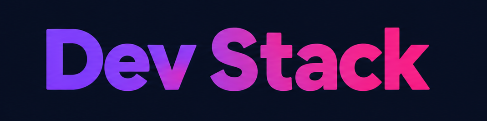

<p align="center">
  

<h1 align="center">Your one-stop solution to scaffolding high-voltage projects</h1>

**Dev Stack** is a web application that allows developers to explore different technologies and build their own personalized technology stack. Users can browse technologies by category, add technologies to their stack, remove individual technologies, or clear the entire stack.

## 🛠️ Technologies Used

- **React** — Building the user interface and managing components.
- **TypeScript** — Providing type safety and better development experience.
- **Tailwind CSS** — Styling and responsive layout.
- **DaisyUI** — Reusable UI components and styling utilities.
- **React-Toastify** — Displaying toast notifications.
- **JSON** — Storing and loading technology data.
- **Vite** — Development server and build tool.

## ✨ Features

- 🧰 **Build Your Own Tech Stack** — Browse available technologies and add them to your personal stack.
- 📱 **Responsive UI** — Designed to work smoothly in mobile and desktop screen sizes.
- 🔔 **Interactive Notifications** — Uses React-Toastify to provide feedback when technologies are added, removed, duplicated, or when the entire stack is cleared.


## 📚 React Questions & Answers

### 1. What is JSX, and why is it used in React?

`JSX` stands for **JavaScript XML**. It allows us to write HTML-like syntax inside JavaScript or TypeScript. It needs to be transpiled into Javascript code for the browser to render the actual UI, which is typically handled by modern build tools like Vite.

React uses JSX because it makes UI code easier to read and allows us to describe how the interface should look directly inside our components.

Example:

```tsx
const heading = <h1>Hello React</h1>;
```

---

### 2. What is the difference between props and state?

`Props` (short for Properties) are data passed from a parent component to a child component. A child component can receive many props and use them to dictate its internal UI.

`State` is data managed by a component internally that can change over time and cause the component to re-render. Typically, it's used to modify UI data upon user interaction and update the UI accordingly.

The main difference between `props` and `state` is: `props` are treated as external data which should not be modified by a child component and `state` is treated as internal memory for a variable which can be freely manipulated by a component.

---

### 3. What does the `useState` hook do, and where did you use it in this project?

The `useState` hook allows a React component to store and update data internally.

In this project, I used `useState` to manage things such as:

- The current page (Home, Projects, Technologies, ........).
  ```tsx
  const [currentPage, setCurrentPage] = useState<string>("home");
  ```
- The list of technologies currently selected by the user.
  ```tsx
  const [selectedTechs, setSelectedTechs] = useState<ITechInfo[]>([]);
  ```
  When the selected technologies change, React re-renders the UI to show the updated stack.

---

### 4. What does the `useEffect` hook do, and why did you need it to load the JSON data?

`useEffect` is used to handle "side effects" in a React component, such as fetching data, interacting with APIs, or working with browser features.

In this project, I did not use `useEffect` to load the technology data from the local JSON file. Instead, I used the new `use` API from React 19, which is a much cleaner and easier way to read and use values from a Promise. I needed to use it because in a real-world web-application, data is typically fetched from an API or database in JSON format and React needs to handle these operations which are outside of it's life-cycle in it's own way through these hooks/APIs.

---

### 5. Why does every item in a `.map()` list need a unique `key` prop?

React uses the `key` prop to uniquely identify each item in a list.

It helps React understand which items have been added, removed, or changed, so it can prevent itself from unnecessary re-renders.

---

### 6. What is conditional rendering? Show one place you used it.

`Conditional Rendering` means displaying different UI depending on a condition.

In this project, I used it in the **Your Stack** section.

If no technology is selected, a message is displayed saying "Your stack is empty". Otherwise, the selected technologies are displayed.

The code implementing `Conditional Rendering`:

```tsx
{selectedTechs.length === 0 ? (
  <EmptyStack />
    ) : (
      <SelectedTechCards
        selectedTechs={selectedTechs}
        setSelectedTechs={setSelectedTechs}
      />
)}
```

---

### 7. How do you pass data from a parent component to a child component, and how does a child send something back to the parent?

A parent component passes data to a child through **props**.

Example:

```tsx
<SelectedTechCards selectedTechs={selectedTechs} setSelectedTechs={setSelectedTechs} />
```

Here, `selectedTechs` and `setSelectedTechs` is passed from the parent to the child.

A child can send information back to the parent by receiving a **callback function as a prop** and calling that function.

Example:

```tsx
<TechCardContainer
  selectedTechs={selectedTechs}
  onAdd={handleAddToStack}
/>
```

The child can then call the `onAdd` handler as needed, which then updates `selectedTechs` owned by the parent. This allows the parent component to control the state while the child communicates user actions back to the parent.
